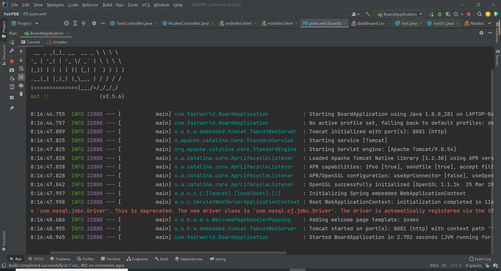

# FairECom
 Prototype implementation of FairECom 

## Background
We have five programs FairCustomer, FairVendor, FairManager, PBB, FairBank. Among them, FairCustomer works on the Customer side, FairVendor works on the Vendor side, FairManager and PBB work on the Manager side, and FairBank works on the Bank side. 

## Install
The above five programs can be installed on four computers or on one computer for testing. If you want to deploy five programs on four computers, you need to modify the ip address of the socket connection in the code, and if you deploy on one computer, you don't need to do anything. 
We used the Mysql database, and the database generation statements at each side are in the corresponding folders. There is a table list_order on the Customer side, two tables nodes and t_manager on the Manager side, and a table translation on the Bank side. Here, username="root", password="123456". You can modify the username and password in "src\main\resources\mybatis-config" to correspond to your own database connection. 

## Usage
 V's sig. verf. success. tid=93d336256cb2fc7b61c9030d24d0f031
B's sig. verf. success. tid=93d336256cb2fc7b61c9030d24d0f031
V's sig. verf. success. tid=94be6b672a642c5c33415e7ccc13c00c
B's sig. verf. success. tid=94be6b672a642c5c33415e7ccc13c00c
## License
