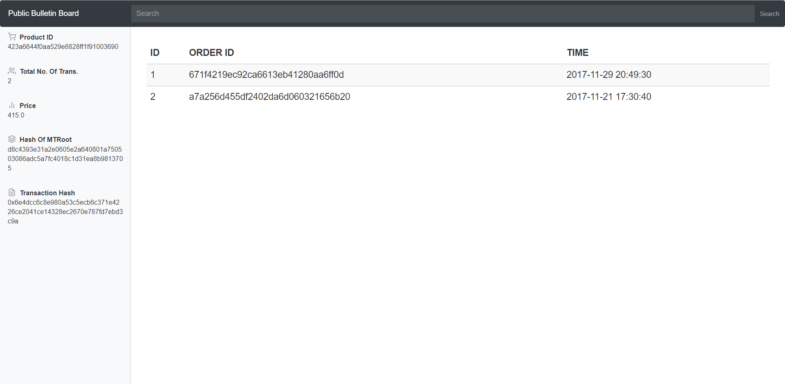

# FairECom
[](https://www.mageworx.com/blog/build-customer-loyalty)
Although various solutions based on Web search or P2P schemes have been designed to discover or prevent e-commerce price discrimination, their efficiency and effectiveness are big concerns. The design of a system that can securely and efficiently prove e-commerce fairness against price discrimination in a privacy-preserving way remains open and challenging.

FairECom targets providing a new centralized solution to solve the disadvantages of the existing schemes. FairECom provides a number of nice features, such as security, accuracy, efficiency, public verifiability, and identity privacy.

## Introduction
####  System Model
There are four types of users in the system, namely `Customer`, `Vendor`, `Manager` and `Bank`. Customer, Vendor, Manager and Bank interact to establish transactions, and Customer and Manager interact to verify whether the transaction price is fair.  Manager also maintains a public bulletin board so that customers or third-party verifiers can visually see the price distribution of products.

Customer, Vendor, and Bank each have a project, which are placed in the `FairCustomer`, `FairVendor`and `FairBank`folders respectively. There are two projects on the Manager side, which are placed in the `FairManager` and `FairPBB`folders. 

####  Technology 
The FairPBB is a project based on [Spring Boot](https://spring.io/projects/spring-boot/) , and uses [web3j](http://web3j.io/) library to provide Ethereum related support.

`FairCustomer`, `FairVendor`,`FairBank` and `FairManager`use  Java's built-in cryptography tools(i.e., SHA, RSA) and  use socket to realize the communication of four users. 

The Manager and Bank store metadata information related to each transaction in a local MySQL database.  The cryptographic accumulator(Merkle Tree)  is stored in a file via java's serialization.

####  Dataset

We use the [Brazilian E-Commerce Public Dataset by Olist](https://www.kaggle.com/olistbr/brazilian-ecommerce/) to test FairECom system. This is a Brazilian ecommerce public dataset of orders made at Olist Store.  The dataset has information of 100k orders from 2016 to 2018 made at multiple marketplaces in Brazil.   `Due to the limited amount of ETH in the Ethereum testnet, we only managed to store 16,697 transactions for 813 products.`  You can view these successful transactions in the t_manager table and verify that their prices are fair.  Later we will test all the data in this dataset. 

## Environmental Requirements

- JDK 1.8
- okhttp3 4.3.1
- web3j 5.0.0

- Spring Boot 2.5.6
- mysql 8.0.26

 We use Intellij IDEA to develop our project .
## Install&Configure 
We need  four computers to simulate`Customer`, `Vendor`, `Manager` and `Bank` respectively.
>Download the `FairCustomer`, `FairVendor` and `FairBank` folders respectively in Customer, Vendor, and Bank. Download `FairManager` and `FairPBB`folders in Manager.

>Modify the `ip address` and `The port number `of the socket connection in the code( if you deploy on one computer, you don't need to do this step).

```java
 Socket socketManager = new Socket("127.0.0.1", 8086);
 Socket socketVendor = new Socket("127.0.0.1", 8089);
 Socket socketBank = new Socket("127.0.0.1", 8087);
```

>Create a new database 'test' in the MYSQL database of `Customer`, `Vendor`, `Manager` and `Bank` respectively. Run list_order.sql, transaction.sql in Customer and Bank respectively. Run node.sql, t_manager.sql in Manager.  The database generation statements at each side are in the corresponding folders.

>Modify the database related configuration  in `"src\main\resources\mybatis-config"` to correspond to your own database connection. 

```java
 <dataSource type="POOLED">
            <property name="driver" value="com.mysql.jdbc.Driver"/>
            <property name="url" value="jdbc:mysql://localhost:3306/test?useSSL=false&amp;useUnicode=true&amp;characterEncoding=utf8"/>
            <property name="username" value="root"/>
            <property name="password" value="123456"/>
 </dataSource>
```


## Usage&Result
Run five projects (run FairCustomer at last). Next, I will show the usage and result of FairCustomer and FairPBB. The  other projects are simple to use and will not be described here. 
### FairPBB
> Run FairPBB. If the situation of the console is the same as that shown in the figure below, it indicates that the project is running successfully.


> After the project runs successfully, access  http://localhost:8081/  you can access the project locally.
>
> After accessing the project, the home page information is as shown in the figure below. Enter the product_id you want to query in the input box to query the information about  the product.


> We take a product in an experimental dataset as an example. In the sidebar of the page, we can clearly see the five properties of the product(i.e., 423a6644f0aa529e8828ff1f91003690). 


> The *Product ID* represents the ID of the product and uniquely identifies a product in the entire dataset. The *Total No. Of Trans.* represents the total number of transactions for this product in a time epoch. The *Price Quantity* denotes the number of different prices for this product during this time epoch. The *Merkle Tree Root* represents the root hash of a Merkel tree whose leaf node value is composed of the Merkle root hash of each price. We have created a smart contract for each product to manage, and The *Contract Address* represents the address of the smart contract. In the table,  we show the relevant information of five different prices of this product in this time epoch. We can see the number of transactions and a digest, for example, *HASH OF MTROOT*, for each price. *HASH OF MTROOT*  is a root hash of a Merkle tree composed of all transactions under this price. We call the function of the smart contract of this product and store the hash value on Ethereum (rinkeby test network). As shown in the table, *TXN HASH* represents the Ethereum transaction hash generated in the stored procedure.

> Click the value of *HASH OF MTROOT* to get all relevant transactions.



> Relevant information about Ethereum storage can also be verified in  [Etherscan]( https://rinkeby.etherscan.io/) . You can enter the Ethereum transaction hash here(i.e., 0x6e4dcc6c8e980a53c5ecb6c371e4226ce2041ce14328ec2670e787fd7ebd3c9a).


> After entering the hash of a transaction, you will get the details of the transaction. 


> Click to see More


> For *Input Data*, we also need to decode it. Click the *decode input data* button under *Input Data* to complete the decoding operation. After decoding, you can clearly see that we called the method of smart contract and stored a value of type string *HASH OF MTROOT* in Ethereum.


> Similarly, we can also query the smart contract address of the product to obtain all interactions with the smart contract, that is, all the information we store on the blockchain for the product. At that time, we can see all transactions under the smart contract. Through the hash value of these transactions, we can still repeat the operation in the previous paragraph. A transaction represents that we have stored a hash value to Ethereum, but note that the number of transactions under a smart contract is more than that shown in PBB. The extra transaction is created the earliest, which represents the creation process of a smart contract.


> As shown in the figure, this product has six different prices, so we need to write six different *MTROOT*, and the first transaction represents the creation of a smart contract.


### FairCustomer

```
Please enter an action to perform ：1.Create transactions.  2.Verify transactions.  3.Quit
1
Order-fulfill:create transactions.
Please enter the product id:
bc76f0b0323c7a007739b72cfc9277bb
C send sig. to V.
C read sig. of V and B.
B's sig. verf. success. tid=585579aed1c5241bcec5569704f086
V's sig. verf. success. tid=585579aed1c5241bcec5569704f086
Order-fulfill success!
```
```
Please enter an action to perform ：1.Create transactions.  2.Verify transactions.  3.Quit
2
Attest-verify: verify transactions.
Please enter verification type: 1. Membership verification.  2.Cardinality verification.  3.Quit
1
Proof of membership start.
Please enter the transaction id to be verified(You can choose the transaction id in table list_order,
i.e.b2e54b3ccbc9c423893aa9dbe19dcd73):
b2e54b3ccbc9c423893aa9dbe19dcd73
C send attestation to M.
C read Acc from Ethereum.
ACC=e9b107c41422ad8f336e97e4fc3407c7c9686f1e85dfced28682630fa9d1d09f
C read proof from M.
Acc verf. success.
Membership verf. success.
```
```
Please enter verification type: 1. Membership verification.  2.Cardinality verification.  3.Quit
2
Proof of cardinality start.
Please enter the product id(i.e.ac6c3623068f30de03045865e4e10089):
ac6c3623068f30de03045865e4e10089
Please enter the price(i.e. 199.9):
199.9
Please enter the number of transactions to verify(1-9)
1
C send attestation to M.
C read proof from M.
C read Acc from Ethereum.
ACC=e9b107c41422ad8f336e97e4fc3407c7c9686f1e85dfced28682630fa9d1d09f
Size verf. success.
Pos. verf. success. pos=0
V's and B's sig. verf. success. tid=00042b26cf59d7ce69dfabb4e55b4fd9
MTRoot verf. success. MTRoot=af6c4cbc1524b29ff38e35d5b7a2171654d1b18c845ba42cd0f05528385fb0b8
Acc verf. success.
Open Node verf. success
Open Node verf. success
Open Node verf. success
Cardinality verification success.
```

## Future Work
1. Add secure channel for communication of four types of users.
2. Further improve system performance.
3. Run all the data in the dataset.
